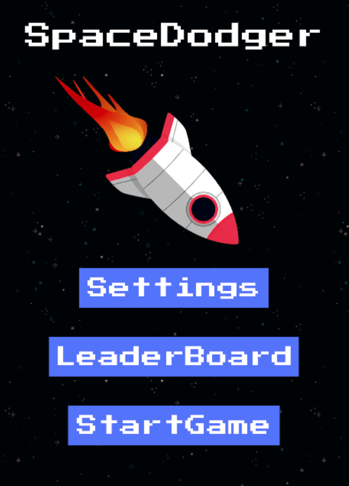

# Phaser 3 Game

> This project is a 2D Game built using the Phaser 3 JavaScript Framework. This website is a fully fledged Game built in JavaScript.

### Space Dodger Screenshot:



# Live Website

### [View Website](https://frosty-goldstine-e40f2f.netlify.app/)

# Getting Started

To get a local copy of the repository please run the following commands in your terminal:

```
$ cd <folder>
```

```
$ git clone git@github.com:jacobrees/Phaser-3-Game.git
```

To launch an instance of this app. Inside your terminal, you will need to navigate into the repository you have just cloned. You will do this by using `cd` inside of your terminal. 

Once you are inside of this folder run the command `npm install` to install all dependencies & `npm start` to open the project in Google Chrome on a development server. 

Below shows the following commands you will need to run to achieve this:

```
$ cd Phaser-3-Game
```

```
$ npm install
```

```
$ npm start
```

# Scripts

Below are a list of scripts you can use with Webpack.

run `npm install` to install all packages associated with project. You will need to do this before you can run any of the other commands listed below.

```
$ npm install
```

run `npm start` to start a development server.

```
$ npm start
```

run `npm run build` to bundle all code into the dist directory.

```
$ npm run build
```

## Built With

- HTML
- SCSS
- JavaScript
- Firebase
- Phaser3
- Webpack

## Authors

👤 **Jacob Rees**

- Github: [@jacobrees](https://github.com/jacobrees)
- Linkedin: [jacob-rees-a6507b1a6](https://www.linkedin.com/in/jacob-rees-a6507b1a6/)


## 🤝 Contributing

Contributions, issues and feature requests are welcome!

## Show your support

Give a ⭐️ if you like this project!

## Acknowledgments

- Code linters used within this project have been developed by Microverse
- Music by [uamee](https://soundcloud.com/uamee)
